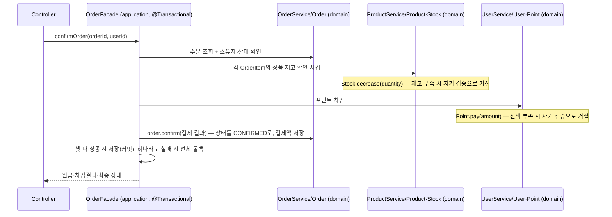

# 2주차 설계 문서

## 1. 버드뷰

```
고객   ──(브랜드 조회, 상품 목록/조회, 좋아요 등록·취소, 내 좋아요 목록,
           포인트 충전, 잔액 조회, 주문 생성, 주문 확정, 내 주문 목록/상세)
        ──→ /api/v1 ─┐
                      ├─→ commerce-api ─→ DB
관리자 ──(브랜드 CRUD, 상품 CRUD, 상품 재고 변경, 주문 목록/상세)
        ──→ /api-admin/v1 ─┘
```

- 모놀리식 구조: `commerce-api` 서버 하나가 모든 요청을 처리하고 DB 하나를 사용한다. (`commerce-batch`, `commerce-streamer`는 이번 라운드 범위 밖)
- 고객과 관리자는 같은 서버로 향하지만, 요구하는 권한이 다르므로 URL 경로로 진입점을 분리한다: 고객은 `/api/v1/**`, 관리자는 `/api-admin/v1/**`.
- 진입점 분리는 단순 경로 정리가 아니라 권한 검사의 기준점이다 (`AdminBoundaryConfig`의 `securityMatcher("/api-admin/**")`가 요청이 컨트롤러에 닿기 전에 ADMIN 권한을 확인).

## 2. 구조와 의존

| 계층 | 책임 (뭐가 바뀌면 이 계층을 고치는가) | 의존 가능 | 의존 불가 |
|---|---|---|---|
| `interfaces` | HTTP 요청/응답 변환 | `application` | `domain`, `infrastructure` |
| `application` | 들어온 요청 처리 순서 조율 | `domain` | `interfaces`, `infrastructure` |
| `domain` | 업무 규칙 그 자체 (배달 방식과 무관하게 항상 지켜야 하는 것) | 없음 | `interfaces`, `application`, `infrastructure` |
| `infrastructure` | DB 등 외부 기술 연동 | `domain` | (제한 없음, 단 `interfaces`/`application`으로부터 의존받으면 안 됨) |

- `domain`은 어떤 계층도 의존하지 않는다 — 반대로 `application`과 `infrastructure`가 `domain`을 의존한다. 방향이 다른 별개의 규칙이다.
- `infrastructure`가 `domain`의 `Repository` 인터페이스를 구현한다(DIP) — `domain`은 실제 구현체(JPA 등)의 존재 자체를 모른다.

## 3. 도메인 관계

### Brand ── Product

- `Brand`와 `Product`는 서로 다른 aggregate. `Product`는 `Brand`를 객체로 참조하지 않고 `brandId`(식별자)만 갖는다.
- 이유: 객체 참조(`@ManyToOne`)로 연결하면 aggregate 경계가 흐려지고(다른 aggregate 내부에 함부로 접근하기 쉬워짐), JPA 연관관계 로딩 문제(N+1)에도 노출된다.
- 상품 응답에 브랜드 정보를 포함해야 할 때는 `application`이 `ProductRepository`와 `BrandRepository`를 각각 조회해서 조합한다. 목록 조회처럼 N개를 처리할 땐 `brandId`를 모아 `findAllById`로 일괄 조회해 N+1을 피한다. ([N+1/일괄조회 정리](../glossary.md))

### User ── Like ── Product

- `Like`는 `Product`와 다른 독립 aggregate. `userId`, `productId`를 ID로만 참조한다.
- 좋아요 등록·취소는 `Product`의 어떤 필드도 변경하지 않는다 — 좋아요 수는 `Like` 테이블에서 그때그때 센다(저장된 카운터 없음). 그래서 `Like`가 `Product`와 같은 트랜잭션/aggregate에 묶일 이유가 없다.
- 중복 방지(같은 유저-상품 조합은 하나만): **애플리케이션 체크(존재 확인 후 등록) + DB 유니크 제약(userId+productId), 둘 다 필요.** 애플리케이션 체크만으로는 두 요청이 거의 동시에 도착하면 둘 다 "없음"으로 판단해 중복 등록이 뚫리는 타이밍 문제가 있고, DB 유니크 제약이 그 상황에서도 원자적으로 막아주는 최종 방어선이다. 애플리케이션 체크는 사용자에게 줄 명확한 에러 메시지를 위한 것이고, DB 제약은 동시성 정합성을 위한 것 — 역할이 다르다.

### Order ── OrderItem, 재고·포인트 책임

- `OrderItem`은 `Order`와 같은 aggregate에 속하는 VO다. `Order` 없이는 존재 의미가 없고(생성 시점에 함께 만들어짐), 한번 만들어지면 `productId`·수량·단가가 바뀌지 않는 스냅샷이라 자기 identity가 중요하지 않다 — 상태가 바뀌는 건 `OrderItem`이 아니라 `Order`(DRAFT→CONFIRMED 등).
  - 단가를 주문 시점에 스냅샷으로 저장하는 이유: `Product`의 가격이 나중에 바뀌어도 이미 만든 주문의 금액은 그대로여야 한다 (Week1 INV-004 "확정 결과 보존"과 같은 원리).
- `Stock`(재고)은 `Product`와 같은 aggregate의 VO다. 근거: 재고 변경 API가 `PUT /api-admin/v1/products/{productId}/stock`로, 독립된 식별자 없이 `Product`에 종속된 하위 자원 모양이다. `Product` 안에서 `decrease(quantity)` 같은 자기 검증 로직을 가진 캡슐화된 객체로 둔다.
- `Point`(포인트 잔액)는 `User`와 같은 aggregate의 VO다. 근거: 포인트 API(`GET /api/v1/points`, `POST /api/v1/points/charge`)에 별도 `pointId`가 없다 — "이 유저의" 잔액이라는 뜻.

## 4. 대표 흐름 — 포인트 충전 → 주문 생성 → 주문 확정

### 생성과 확정을 분리하는 이유

- 실제로는 결제(PG)가 끝난 뒤에야 주문이 확정된다. 이 과제는 PG 대신 포인트로 결제하지만, "만들기"와 "확정(결제 성공)"이 별개 사건이라는 구조는 같다.
- 더 중요한 이유: **생성 시점에 재고·포인트를 먼저 차감해버리면, 확정되지 않을 수도 있는 주문 때문에 자원이 묶인다.** 예를 들어 재고 1개 남은 상품을 누군가 DRAFT로 주문해놓고 확정을 안 하면, 실제로 사려는 다른 사용자가 재고가 남아있는데도 주문을 못 하게 된다. 그래서 "생성 시 차감 없음, 확정 시에만 차감"이다.

### 세 개의 aggregate가 함께 바뀌는 문제

주문 확정 한 번에 `Order`(DRAFT→CONFIRMED), `Product`(재고 차감), `User`(포인트 차감) — 서로 다른 aggregate 셋이 같이 바뀌어야 한다.

- **원자성이 필요하다**: 셋 중 하나라도 실패하면 전부 롤백돼야 한다 (재고만 깎이고 포인트는 안 깎이는 상태가 생기면 안 됨).
- **같은 DB, 같은 트랜잭션으로 처리한다**: 이 시스템은 모놀리식 · 단일 DB이므로(1번 버드뷰), 서로 다른 aggregate라도 하나의 로컬 DB 트랜잭션으로 묶는 데 기술적 제약이 없다. (다른 서비스/DB로 쪼개져 있었다면 분산 트랜잭션·보상 트랜잭션 같은 걸 고민해야 했겠지만, 지금은 해당 없음.)
- **조율은 `application`이 한다**: `OrderService`(domain)가 `Product`나 `User`를 직접 건드리지 않는다. 2번(구조와 의존)에서 정한 대로, "여러 aggregate를 순서대로 불러 조율하는 일"은 `application`의 책임이다. 각 aggregate는 자기 상태만 자기 메서드로 바꾼다.



- `Product`(재고)와 `User`(포인트)의 검증은 각자 캡슐화된 메서드(`decrease`, `pay`) 안에서 일어난다 — `application`은 순서만 조율하고 검증 로직 자체는 모른다 (Week1부터 이어지는 원칙).
- 확정 이후 `OrderItem`에 저장된 단가·수량은 이후 `Product` 가격 변경과 무관하게 그대로 유지된다.

## 5. 불변식

400/409 기준은 Week1과 동일: **입력을 바꾸면 해결되는가 → 400, 리소스 상태를 먼저 바꿔야 하면 → 409.**

**TODO(동시성)**: `Stock.decrease()`/`Point.pay()`는 지금 "읽고→메모리에서 검증·차감→저장" 방식이다. 재고 1개짜리 상품에 동시에 두 주문이 확정을 시도하면 둘 다 "재고 충분"으로 통과할 수 있는 경합(race condition)이 있다 — 멘토링(Devin)에서 지적받음. `Product`/`User` 구현 시 비관적 락·낙관적 락·원자적 UPDATE 중 하나로 막아야 한다. (`docs/glossary.md` 참고)

| 규칙 | 책임 위치 | 위반 시 |
|---|---|---|
| 재고 차감 요청 수량은 양수, 차감 후 수량은 0 이상 | `Stock.decrease()` | 400 — 수량을 줄여서 재요청하면 해결됨 |
| 포인트 충전 요청 금액은 양수 | `Point.charge()` | 400 |
| 포인트 차감 후 잔액은 0 이상 | `Point.pay()` | 400 — 결제액을 줄이거나 먼저 충전하면 해결됨 |
| 이미 `CONFIRMED`인 주문은 재확정 불가 | `Order.confirm()` | 409 — 어떤 입력을 보내도 안 되고, 이 주문 자체를 재확정할 수 없음 (다른 흐름으로) |
| 주문 소유자와 요청자가 다름 | `Order` (소유권 검증) | 404 — Week1 INV-001과 동일하게, 주문 존재 여부 노출 방지 |
| 같은 사용자-상품 좋아요는 하나만 저장 | `Like` (앱 체크 + DB 유니크 제약) | 409 — 이미 있는 관계라 입력을 바꿔도 소용없음 |
| 삭제된 상품에는 새 좋아요 등록 불가 | `Like` 등록 시 `Product` 삭제여부 확인 | 404 |
| 삭제되지 않은 상품이 남아있는 브랜드는 삭제 불가 (재고 0인 상품 포함) | `Brand` 삭제 시 `Product` 존재여부 확인 | 409 — 상품을 먼저 정리해야 풀림 |
| 삭제된 브랜드·상품은 고객 조회·신규 주문·수정·재고변경 대상에서 제외 | 각 조회/변경 로직 | 404 |
| 주문 생성 시 상품 존재·미삭제, 수량 양수를 확인 | `Order` 생성 검증 | 400(수량) / 404(상품) |
| 한 주문 안에 같은 상품이 여러 품목으로 들어오면 수량을 합쳐 하나로 만든다. 재고 확인은 합산된 총수량 기준 | `Order` 생성 로직 | — (거절이 아니라 병합) |
| 상품 수정 시 브랜드는 변경되지 않는다 (수정 API 입력에 브랜드 변경 항목 없음) | `Product` 수정 로직 | — |
| 상품 이름은 비어있지 않고 255자 이하 | `Product` 생성자/수정 | 400 |
| 상품 가격은 0 이상(음수 불가), 상한 없음 | `Product` 생성자/수정 | 400 |

이름·가격 검증 범위를 최소로 잡은 이유: 상품 등록·수정은 관리자 전용 API라 일반 사용자의 악의적 입력 리스크가 낮고, XSS 같은 문제는 입력 차단보다 출력(렌더링) 단계에서 막는 게 정석이라 특수문자 제한의 실효성이 낮다. 글자수 상한(255)만 DB 컬럼 제약 때문에 둔다.

## 6. 삭제 방식

`Brand`, `Product` 둘 다 **soft delete**(`BaseEntity`의 `deletedAt`)를 쓴다. (`Order`는 삭제 API 자체가 없어서 해당 없음.)

- `Brand`: `BaseEntity`가 이미 전역적으로 soft delete를 지원하고, 재사용성을 위해 다른 동작을 추가하지 않는다는 원칙(`BaseEntity` 주석)이 있어 굳이 다른 방식을 쓸 이유가 없다.
- `Product`: **hard delete는 못 쓴다.** `OrderItem`은 `productId`만 갖고 상품 이름은 저장하지 않는다(스냅샷은 수량·단가까지만). `Product`를 물리적으로 지우면 과거 주문 상세에서 상품명을 조회할 방법이 없어져 주문 내역 자체가 깨진다. soft delete로 행을 남겨두면, "삭제된 상품은 신규 주문·조회 대상에서 제외"하는 규칙은 조회 로직에서 `deletedAt`을 걸러내는 것으로 처리하고, 과거 `OrderItem`의 상품명 조회는 계속 가능하다.

## 7. 고객·관리자 응답 필드 구분

상품/브랜드 응답은 고객·관리자 모두 같은 필드를 본다(id, name, price, 재고, brand 정보, 좋아요 수 — 재고를 숨길 뚜렷한 이유가 없음). 관리용 메타데이터(`deletedAt`, `createdAt`, `updatedAt`)만 관리자 응답에 추가로 노출한다.

## 8. API 계약표

### 고객 (`/api/v1`)

| method·path | 입력 | 성공 | 대표 오류 |
|---|---|---|---|
| `GET /brands/{brandId}` | - | 200, 브랜드 상세 | 404 (없음/삭제됨) |
| `GET /products` | `brandId?`, `sort`(latest/price_asc/likes_desc), 페이지 | 200, 목록+브랜드정보+좋아요수 | 400 (잘못된 sort 값) |
| `GET /products/{productId}` | - | 200, 상세 | 404 |
| `POST /products/{productId}/likes` | - | 200 | 404(상품없음/삭제됨), 409(이미 좋아요) |
| `DELETE /products/{productId}/likes` | - | 200 | 404(상품없음), 관계 없어도 200(멱등 처리) |
| `GET /users/{userId}/likes` | - | 200, 내 좋아요 목록 | 404 (요청자≠userId, 존재 비노출) |
| `POST /points/charge` | `amount`(양수) | 200, 충전 후 잔액 | 400 (0 이하/타입 오류) |
| `GET /points` | - | 200, 잔액 | - |
| `POST /orders` | 품목 목록(productId, 수량) | 201, DRAFT 주문 | 400(수량), 404(상품없음/삭제됨) |
| `POST /orders/{orderId}/confirm` | - | 200, CONFIRMED 주문(결제액 포함) | 404(소유자 아님), 409(이미 확정됨), 400(재고·포인트 부족) |
| `GET /orders` | - | 200, 내 주문 목록 | - |
| `GET /orders/{orderId}` | - | 200, 내 주문 상세 | 404(소유자 아님) |

### 관리자 (`/api-admin/v1`, 전부 ADMIN 권한 필요 → 아니면 403)

| method·path | 입력 | 성공 | 대표 오류 |
|---|---|---|---|
| `GET /brands` | - | 200, 목록 | - |
| `POST /brands` | name, description, category | 201 | 400(유효성) |
| `GET /brands/{brandId}` | - | 200 | 404 |
| `PUT /brands/{brandId}` | name, description, category | 200 | 400, 404 |
| `DELETE /brands/{brandId}` | - | 200 | 409(미삭제 상품 존재), 404 |
| `GET /products` | - | 200, 목록 | - |
| `POST /products` | name, price, brandId, 초기재고 | 201 | 400(유효성), 404(브랜드없음/삭제됨) |
| `GET /products/{productId}` | - | 200 | 404 |
| `PUT /products/{productId}` | name, price (brandId 변경 불가) | 200 | 400, 404 |
| `DELETE /products/{productId}` | - | 200 | 404 |
| `PUT /products/{productId}/stock` | 최종 수량(0 이상) | 200 | 400(음수), 404 |
| `GET /orders` | - | 200, 전체 주문 목록 | - |
| `GET /orders/{orderId}` | - | 200, 주문 상세 | 404 |

**남은 오픈 이슈**: 좋아요 취소를 관계가 없는데도 호출하면 멱등하게 200으로 둘지, 404로 거절할지는 초안으로 200(멱등)을 넣어뒀는데 확정은 아님 — 필요하면 다시 논의.
